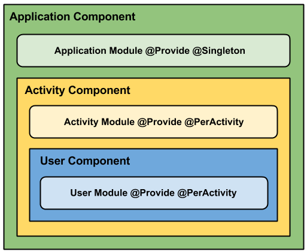

#妹news
最近公司事情不多,加上最近学习dagger2总觉得要写点什么出来,于是乎就写了这么一个小应用
- 这边首先要感谢[代码家]()提供的开放api接口
- 另外还要感谢[JessYan](https://github.com/JessYanCoding)于dagger2的在项目中应用的学习很大一部分都是学的大佬的[MvpArms](https://github.com/JessYanCoding/MVPArms)开源框架

##dagger2的应用
先放一张[官网](https://google.github.io/dagger/)图

这张图贼难理解,但是理解好了也是很重要的,首先dagger2应用于项目他的分层很重要

Application Component: 生命周期跟Application一样的组件。可注入到AndroidApplication和BaseActivity中类中

Activity Component: 生命周期跟Activity一样的组件

Fragment Component: 生命周期跟Fragment 一样的组件

关于dagger2学习的文章:
[详解Dagger2](http://www.jcodecraeer.com/a/anzhuokaifa/androidkaifa/2015/0519/2892.html)

[基于google-mvp-dagger2分支的讲解](http://www.jianshu.com/p/01d3c014b0b1)

##遇到的坑
展示图片列表瀑布流时候,图片错乱以及闪烁问题,原因主要是因为在加载图片时候没有预设置大小，填充时候需要默认没有ImageView的宽高都是0

运行时截图

